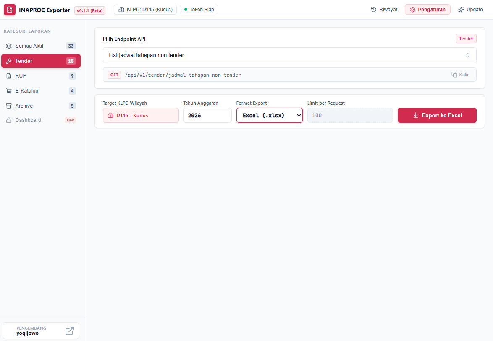

# INAPROC Desktop Exporter

Pusat Distribusi Resmi dan Berkas Instalasi Aplikasi Desktop INAPROC Exporter (Windows).

Aplikasi utilitas desktop berbasis Windows yang ditenagai engine native **Rust (Tauri v2)** untuk mengekstraksi, memformat, menganalisis, dan mengekspor data pengadaan barang dan jasa pemerintah secara langsung dari Gateway API resmi INAPROC (LKPP) ke dalam berbagai format file: **Microsoft Excel (.xlsx)**, **CSV (.csv)**, **JSON (.json)**, dan **SQL Dump (.sql)**.

Dirancang khusus untuk mempermudah tugas pengelola LPSE, PPK, Pokja Pemilihan, Auditor Pengadaan, dan Analis Kebijakan di lingkungan Pemerintah Daerah, Kementerian, dan Lembaga Negara dengan performa tinggi dan konsumsi memori yang sangat efisien (< 50 MB RAM).

---

## Antarmuka Aplikasi

---

## Unduhan Rilis Resmi (Versi 0.7.1)

Berkas eksekusi resmi tersedia dalam dua varian paket untuk sistem operasi Windows (64-bit):

| Nama Berkas | Tipe Paket | Keterangan | Tautan Unduhan Langsung |
| :--- | :--- | :--- | :--- |
| **INAPROC.Exporter_0.7.1_x64-setup.exe** | Installer Wizard *(Direkomendasikan)* | Instalasi resmi dengan shortcut desktop & uninstaller | [Unduh Installer](https://github.com/yogijowo/inaproc-desktop-releases/releases/download/v0.7.1/INAPROC.Exporter_0.7.1_x64-setup.exe) |
| **INAPROC.Exporter_0.7.1_x64.msi** | Windows MSI Installer | Paket instalasi standar Windows MSI | [Unduh MSI](https://github.com/yogijowo/inaproc-desktop-releases/releases/download/v0.7.1/INAPROC.Exporter_0.7.1_x64.msi) |
| **INAPROC.Exporter.exe** | Standalone Portable | Berkas portabel mandiri, langsung jalankan tanpa instalasi | [Unduh Portable](https://github.com/yogijowo/inaproc-desktop-releases/releases/download/v0.7.1/INAPROC.Exporter.exe) |

> Seluruh riwayat pembaruan dan rilis sebelumnya dapat dilihat melalui halaman [GitHub Releases](https://github.com/yogijowo/inaproc-desktop-releases/releases).

---

## Catatan Rilis & Fitur Baru (Versi 0.7.1)

- **Tab Switcher Analitik (Pagu vs Paket)**: Pilihan mode analitik di header Dashboard untuk beralih instan antara **Berdasarkan Pagu (Nilai Rupiah)** dan **Berdasarkan Paket (Jumlah Paket)**.
- **Tampilan Nilai & Persentase Langsung**: Seluruh grafik (donut chart, stacked bar, gauge) langsung menampilkan nominal/kuantitas dan persentase (%) tanpa harus mengarahkan kursor (*hover*).
- **Donut Chart Center Total**: Bagian tengah lingkaran donat langsung menampilkan tulisan `TOTAL` beserta nilai agregatnya.
- **100% Stacked Bar Labels**: Angka Pagu/Target langsung tampil di atas setiap batang grafik dan rincian nominal/paket + persentase langsung tercetak di dalam tiap segmen warna.
- **Tabel Realisasi Satker / OPD Adaptif**: Header kolom, format angka, dan pengurutan (*sorting*) otomatis beralih antara nilai pagu dan kuantitas paket dengan pencarian instan (*live search*).
- **Offline Caching SQLite**: Data dashboard tersimpan otomatis secara lokal per kode KLPD dan tahun anggaran sehingga dapat dilihat kapan saja tanpa koneksi internet.
- **Arsitektur Modular**: Pemisahan modul dashboard ke `dashboard.js` untuk stabilitas dan pemeliharaan kode yang lebih baik.

---

## Panduan Instalasi

### Metode 1: Menggunakan Installer Wizard (Rekomendasi)

Paket installer menyediakan integrasi penuh ke dalam sistem Windows, termasuk shortcut di Desktop dan Start Menu serta uninstaller resmi.

1. Unduh berkas `INAPROC.Exporter_0.7.1_x64-setup.exe` melalui tautan di atas.
2. Klik ganda berkas installer yang telah diunduh.
3. Apabila muncul peringatan keamanan **Windows SmartScreen** (*Windows protected your PC*):
   - Klik teks **More info** atau **Info selengkapnya**.
   - Klik tombol **Run anyway** atau **Tetap jalankan**.
   *(Peringatan ini wajar terjadi pada rilis aplikasi baru mandiri yang belum berbayar sertifikat komersial tahunan)*.
4. Ikuti petunjuk di layar hingga proses instalasi selesai.
5. Aplikasi siap dibuka melalui shortcut di Desktop atau Start Menu.

### Metode 2: Menggunakan Versi Portable

Versi portable dapat langsung dijalankan tanpa melalui proses instalasi dan tidak membutuhkan hak administrator.

1. Unduh berkas `INAPROC.Exporter.exe`.
2. Letakkan di folder kerja pilihan Anda (misalnya di drive `D:\`, folder Dokumen, atau flashdisk).
3. Klik ganda berkas untuk langsung menggunakan aplikasi.

---

## Panduan Konfigurasi Awal

Untuk menjaga keamanan kredensial instansi, aplikasi tidak memuat Kode KLPD maupun Token API bawaan. Konfigurasi diatur secara mandiri:

1. Buka aplikasi **INAPROC Exporter**.
2. Buka menu **Pengaturan** di bilah menu samping.
3. Isi data konfigurasi:
   - **Kode KLPD**: Kode instansi Anda (contoh: `D145` untuk Pemerintah Kabupaten Kudus).
   - **Nama Instansi**: Label instansi Anda (contoh: `Pemerintah Kabupaten Kudus`).
   - **Token Bearer INAPROC**: Token API resmi yang diterbitkan oleh LKPP.
   - **Tahun Anggaran Default**: Tahun anggaran default yang otomatis terisi pada form ekspor.
   - **Folder Penyimpanan**: Folder default tujuan penyimpanan file hasil ekspor.
4. Klik tombol **Uji Koneksi API** untuk memastikan token dan gateway dapat diakses.
5. Klik **Simpan Pengaturan**.

---

## Panduan Ekspor Data

1. **Pilih Kategori & Data**: Pada halaman **Ekspor Data**, centang satu atau beberapa data pengadaan yang ingin ditarik (tersedia tombol *Pilih Semua* per kategori).
2. **Atur Parameter Tambahan**:
   - Jika memilih *Pengumuman Tender*, Anda dapat memasukkan kode tender tertentu atau membiarkannya kosong untuk mengekspor semua tender.
   - Jika memilih *List Produk Penyedia* / *Detail Penyedia*, pilih mode relasi (Otomatis dari E-Purchasing atau Input Manual).
3. **Pilih Tahun & Format**: Masukkan tahun anggaran dan pilih format keluaran (**Excel**, **CSV**, **JSON**, atau **SQL**).
4. **Mulai Ekspor**: Klik tombol **Mulai Ekspor**.
5. File hasil ekspor akan otomatis tersimpan di folder tujuan yang telah ditentukan, dan ringkasan ekspor akan tercatat di menu **Riwayat**.

---

## Spesifikasi Format Ekspor

| Format File | Ekstensi | Karakteristik Teknis |
| :--- | :---: | :--- |
| **Microsoft Excel** | `.xlsx` | Dilengkapi auto-fit kolom dinamis dan auto-filter pada baris header. Dibuat langsung di memori. |
| **Comma-Separated Values** | `.csv` | Dilengkapi standar encoding UTF-8 Byte Order Mark (BOM) sehingga karakter gelar dan teks Indonesia terbuka rapi di Excel. |
| **JavaScript Object Notation** | `.json` | Data terstruktur berformat rapi (*pretty-printed* 2-spasi) siap pakai untuk integrasi sistem. |
| **SQL Script Dump** | `.sql` | Menghasilkan skrip DDL `CREATE TABLE IF NOT EXISTS` dan perintah `INSERT INTO` batch yang kompatibel dengan SQLite, MySQL, dan PostgreSQL. |

---

## Cakupan Endpoint API

Aplikasi mendukung endpoint Gateway INAPROC LKPP yang terbagi dalam modul-modul berikut:

### 1. Modul Dashboard & Analitik (Interaktif)
- **Perencanaan Pengadaan**: Belanja Pengadaan, Total RUP, % Pengisian RUP, Penyedia vs Swakelola, PDN vs Impor, UMKK vs Non-UMKK, Metode Pemilihan (Donut), Jenis Pengadaan (Donut).
- **Realisasi Pengadaan**: Total Realisasi, Pembagian Pemilihan vs Kontrak, Capaian Penyedia & Swakelola, Metode Pemilihan Realisasi (Donut), Jenis Pengadaan Realisasi (Donut), 100% Stacked Bar Metode & Jenis, Gauges UMKK & PDN.
- **Tabel Satker / OPD**: Rincian realisasi tiap perangkat daerah lengkap dengan status performa dan live search.

### 2. Modul Tender (15 Endpoint Aktif)
- Jadwal Tahapan Non-Tender
- Jadwal Tahapan Tender
- Rekapitulasi eKontrak
- Daftar Pengumuman Tender (dengan filter opsional kode tender)
- Pengumuman Non-Tender
- Rekapitulasi Non-Tender Selesai
- Pencatatan Non-Tender Realisasi
- Pencatatan Swakelola Realisasi
- Daftar Peserta Tender
- Peserta Tender Menang
- Tender Selesai Berdasarkan Nilai
- SPPBJ Tender
- Surat Pesanan E-Purchasing
- Realisasi E-Purchasing
- Rincian Paket Tender

### 3. Modul RUP (9 Endpoint Aktif)
- Master Satuan Kerja (Satker)
- Paket Anggaran Penyedia
- Paket Anggaran Swakelola
- Paket Penyedia Terumumkan
- Paket Swakelola Terumumkan
- Program Master RUP
- Daftar Paket Penyedia
- Daftar Paket Swakelola
- Riwayat Kaji Ulang RUP

### 4. Modul E-Katalog (4 Endpoint Aktif)
- Daftar Paket E-Purchasing Versi 6
- Detail Informasi Penyedia Katalog (dengan opsi relasi E-Purchasing otomatis)
- Daftar Produk Penyedia Katalog (dengan opsi relasi E-Purchasing otomatis)
- Daftar Kategori Produk Katalog

### 5. Modul E-Katalog Archive (5 Endpoint Aktif)
- Paket E-Purchasing Arsip
- Instansi dan Satuan Kerja Arsip
- Detail Komoditas Arsip
- Detail Penyedia Arsip
- Detail Distributor Arsip

---

## Keamanan & Privasi

- **Database Lokal**: Seluruh data pengaturan kredensial dan riwayat unduhan disimpan secara lokal pada komputer pengguna di direktori lokal database SQLite.
- **Zero Third-Party Telemetry**: Aplikasi tidak mengirimkan data pengguna, token, maupun isi laporan ke server pengembang maupun pihak ketiga lainnya. Seluruh lalu lintas data hanya berlangsung secara langsung antara komputer pengguna dan Gateway resmi LKPP (`https://data.inaproc.id`).
- **In-Memory Streaming**: Proses konversi data berlangsung di dalam memori kerja (RAM) komputer sehingga tidak meninggalkan sampah file di disk.

---

## Persyaratan Sistem

- **Sistem Operasi**: Windows 10 (64-bit) atau Windows 11 (64-bit).
- **Runtime**: Microsoft Edge WebView2 Evergreen Runtime (sudah bawaan pada Windows 10/11).
- **Prosesor**: Intel / AMD 64-bit.
- **Memori (RAM)**: Minimal 2 GB (Disarankan 4 GB+).
- **Ruang Disk**: Minimal 50 MB ruang kosong.
- **Koneksi Jaringan**: Akses internet aktif ke `data.inaproc.id`.
- **Kredensial**: Token API INAPROC resmi yang aktif.

---

## Tentang Pengembang & Disclaimer

Aplikasi ini dikembangkan secara independen oleh:
- **Nama**: Yogi Anggoro, S.Kom
- **Jabatan**: Pranata Komputer Ahli Pertama pada Bagian Pengadaan Barang dan Jasa Sekretariat Daerah Kabupaten Kudus
- **GitHub**: [github.com/yogijowo](https://github.com/yogijowo)
- **Dukungan / Traktir Kopi**: [saweria.co/yogijowo](https://saweria.co/yogijowo)

**Disclaimer:**
Aplikasi ini bukan merupakan aplikasi resmi yang diterbitkan oleh Lembaga Kebijakan Pengadaan Barang/Jasa Pemerintah (LKPP) maupun GovTech Procurement / Telkom Indonesia. Aplikasi ini dibuat sebagai alat bantu utilitas mandiri bagi pengelola pengadaan di daerah untuk mempermudah backup dan pelaporan data.

---

## Lisensi

Aplikasi ini didistribusikan di bawah ketentuan [MIT License](LICENSE). Hak Cipta (c) 2026 Yogi Anggoro.
